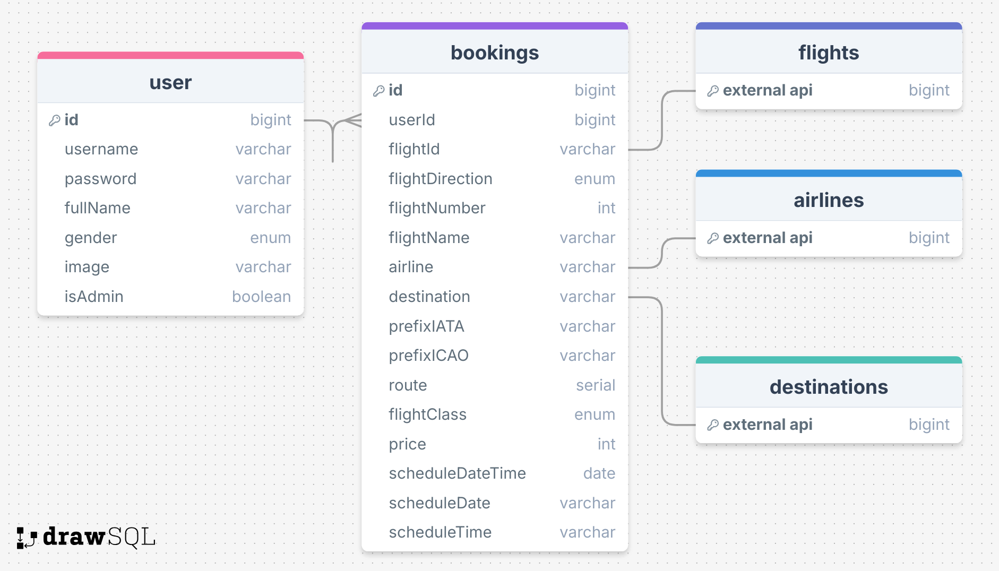

<a name="readme-top"></a>
 
 
<!-- PROJECT LOGO -->
<br />
<div align="center">
   
  <a href="https://github.com/ibrsec/plane-scape-fs">
    
  </a>

  <h3 align="center">Full stack Plane Scape App</h3>

  <p align="center">
    An awesome Full-stack Flight Booking App
    <!-- <a href="https://github.com/ibrsec/stock-app"><strong>Explore the docs »</strong></a> -->
    <br />
    <br />
    <a href="https://plane-scape-fs.onrender.com/">View Demo</a>
    ·
    <a href="https://github.com/ibrsec/plane-scape-fs/tree/main/client">Frontend Repo</a>
    ·
    <a href="https://plane-scape-fs.onrender.com/api/documents/swagger">Backend Swagger</a>
    ·
    <a href="https://github.com/ibrsec/plane-scape-fs/issues">Report Bug</a>
    ·
    <a href="https://github.com/ibrsec/plane-scape-fs/issues">Request Feature</a>
  </p>
</div>


<!-- TABLE OF CONTENTS -->
<details>
  <summary>📎 Table of Contents 📎 </summary>
  <ol>
    <li><a href="#about-the-project">About The Project</a></li>
     <!-- <li><a href="#figma">Figma</a></li> -->
     <li><a href="#overview">Overview</a></li>
     <li><a href="#quick-setup">Quick Setup</a></li>
     <li><a href="#directory-structure">Directory structure</a></li>
     <li><a href="#built-with">Built With</a></li>
    <!-- <li>
      <a href="#getting-started">Getting Started</a>
      <ul>
        <li><a href="#prerequisites">Prerequisites</a></li>
        <li><a href="#installation">Installation</a></li>
      </ul>
    </li>
    <li><a href="#usage">Usage</a></li>
    <li><a href="#roadmap">Roadmap</a></li>
    <li><a href="#contributing">Contributing</a></li>
    <li><a href="#license">License</a></li>
    <li><a href="#contact">Contact</a></li>
    <li><a href="#acknowledgments">Acknowledgments</a></li> -->

    
  </ol>
</details>


---

<!-- ABOUT THE PROJECT -->
<a name="about-the-project"></a>
## ℹ️ About The Project
 
[](https://plane-scape-fs.onrender.com/) 
[](https://plane-scape-fs.onrender.com/) 
---
<b>ERD:</b>
[](https://plane-scape-fs.onrender.com/)


<p align="right">(<a href="#readme-top">back to top</a>)</p>


---
 


<a name="overview"></a>
## 👀 Overview

📦 A Fullstack Plane Scape Project</br>
🏀 [Frontend Live](https://plane-scape-fs.onrender.com/) || [Backend Swagger](https://plane-scape-fs.onrender.com//api/documents/swagger) </br></br>

<b>Explanations:</b> </br>


🚩 Since the project is deployed on render.com  using the free tier, it may occasionally enter sleep mode, which can result in a longer initial loading time.

🚩 Flights are fetched from the Schiphol API on the backend.

🚩 On the homepage, flights are listed with pagination. Filters for date, flight direction, and sorting are applied.

🚩 Users can view detailed flight information by clicking the "Check Details" button.

🚩 Each flight card displays the flight status and flight direction. Hovering over the flight status provides a description.

🚩 Users can book a flight by clicking the "Book" button, which opens a modal where they can select the flight class.

🚩 After logging in, users can book flights and view their booked flights on the "My Flights" page.

🚩 Bookings are saved to MongoDB with my backend (Express.js).

🚩 When a user books a flight, an email is sent to them via Nodemailer.

🚩 When saving bookings, I also store the airline and destination information, allowing users to search for flights on the "My Flights" page using these fields.

🚩 The "My Flights" page displays all flight information, and like the homepage, there is a "Flight Details" modal accessible via a button.

🚩 Users can delete their bookings by clicking the "Delete" button.

🚩 All screens have been optimized for responsive design.

---
<b>FRONTEND:</b> </br>

🎯 React Development: Built an intuitive flight booking interface using React.js to provide a seamless and user-friendly experience for travelers.

🛠 State Management: Utilized Redux Toolkit and Persist to manage flight data, destinations, airlines, bookings, and user preferences efficiently.

🚀 React Router: Integrated React Router to allow users to navigate smoothly between home page, my flights, login and register pages.

🔔 User Notifications: Implemented real-time notifications using React Toastify to keep users informed of flight bookings, deletions, search results.

🧮 Functional Highlights: Utilized React Toastify, implemented time calculations, password validation, and stored flight class and flight statuses as constants.

🔍 Search Functionality: Developed advanced search features enabling users to filter flights by date, flight direction, destination and airline. 

🎨 UI Design: Designed a clean and responsive user interface using Tailwind CSS, ensuring a consistent experience across devices.

</br></br>

<b>BACKEND:</b> </br>

🎯 Express.js Framework: Developed a comprehensive RESTful API using Express.js for secure and efficient flight data management.

🔗 External API Integration: Fetched real-time flight information from schiphol API, enabling users to search, book, and list available flights.

🔒 Authentication & Authorization: Implemented JWT-based authentication for secure user login and session management.

📤 Flight Bookings & Email Notifications: Enabled flight bookings, saving the data in MongoDB, and sending confirmation emails to users using Nodemailer.

📄 API Documentation: Created detailed API documentation with Swagger, facilitating easy testing and usage of the API.

📊 Database Management: Used MongoDB and Mongoose for managing flight bookings, user data, and other related information, ensuring consistent querying and modeling.

🔄 CRUD Operations: Built full CRUD functionality for bookings, and users, allowing for efficient flight booking management and user data handling.

🛠 Middleware & Error Handling: Added custom middlewares for request validation, permissions, query handling, authentication and global error handling using express-async-errors for consistent error management.

✉️ Email Notifications: Automatically sent booking confirmation emails to users using Nodemailer after successful flight reservations.

🌐 Scalable Deployment: Deployed on render.com to ensure scalability and availability.


<p align="right">(<a href="#readme-top">back to top</a>)</p>


<a name="quick-setup"></a>
## 🛫 Quick Setup

```sh
# clone the project
git clone https://github.com/ibrsec/plane-scape-fs.git

# enter the project directory
cd plane-scape-fs

# set the .env file to the root of the project
# .env-sample is exist on the project
# .env file fields are also below

# install dependency
# linux
npm run setup-production
# windows
npm run setup-production-windows

# run
node index.js

#Land on
http://localhost:10000 from browser

```

```sh
# .env file
PORT=10000
# HOST=localhost # for swagger
HOST=plane-scape-fs.onrender.com # for swagger
CONNETION_STRING_MONGODB=<mongodb_connection_string>
NODE_ENV=prod
PAGE_SIZE=15
SECRET_KEY=sdkjasdasdfffbKdfgJHB768r6GJHV865R&%5623yvasytfg # for password encrypt
ACCESS_KEY=sdkjfskfjsdfhsdgfgdfdUIH^T*%^uig96785ftivybu2on3ipfyisg # for jwt
REFRESH_KEY=sdkjfssdfsdfkfsdfjhdUIH^T*%^uig96785ftivybu2on3ipfyisg # for jwt
SCHIPHOL_APP_ID=<schiphol_app_id>
SCHIPHOL_APP_KEY=<schiphol_app_key>
SCHIPHOL_RESOURCE_VERSION=v4
SCHIPHOL_URL=https://api.schiphol.nl/public-flights
MAILJET_API_KEY=<mailjet_app_key>
MAILJET_USER=<mailjet_user> 
```

<p align="right">(<a href="#readme-top">back to top</a>)</p>


 


<a name="directory-structure"></a>
## 📂 Directory structure 

```diff
+ plane-scape-fs  (folder)  
      |---client (folder)   
      |      |          
      |      |---public (folder) 
      |      |                
+     |      |---src (folder) 
      |      |     |---assests (folder) 
      |      |     |           
      |      |     |---pages (folder)       
      |      |     |           
      |      |     |---components (folder) 
      |      |     |    
      |      |     |---app (folder) ---store.jsx      
      |      |     |          
      |      |     |---features (folder) (slices and store)         
      |      |     |          
      |      |     |---router (folder)         
      |      |     |          
      |      |     |---services (folder)              
      |      |     |          
      |      |     |---helper (folder)          
      |      |     |          
      |      |     |---App.js 
      |      |     |---App.css 
      |      |     |---Index.js
      |      |     └---Index.css
      |      |      
      |      |----package.json 
      |      |----tailwind.config.js 
      |      └----readme.md 
      |      
+     |---src (folder) 
      |     |---config (folder)       
      |     |           
      |     |---controllers (folder) 
      |     |    
      |     |---errors (folder) 
      |     |    
      |     |---helpers (folder)      
      |     |          
      |     |---middlewares (folder)      
      |     |          
      |     |---models (folder)           
      |     |          
      |     └---routes (folder)  
      |      
      |----.env
      |----.gitignore
      |----index.js
      |----package-lock.json
      |----package.json
      |----swaggerAutogen.js
      └----readme.md 
```

<p align="right">(<a href="#readme-top">back to top</a>)</p>

---

<a name="built-with"></a>
### 🏗️ Built With
<b>Frontend</b>
 
<!-- https://dev.to/envoy_/150-badges-for-github-pnk  search skills-->

 
  
   
  
  

  
  
   

  
  
 
  
 


---

<b>Backend</b>
<!-- https://dev.to/envoy_/150-badges-for-github-pnk  search skills-->


  
  
  
  
  
  
   

<!-- swagger -->
  
   

  
  
  
  
 

  
  


 
<p align="right">(<a href="#readme-top">back to top</a>)</p>


